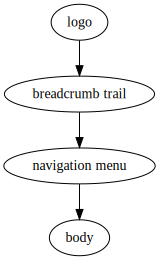

# Nancy Cookbook

See the [README](README.md) for installation and usage. The rest of this
document shows examples of its use.

## Generating a web site <a name="website-example"></a>

Suppose a web site has the following page design:



Most of the elements are the same on each page, but the breadcrumb trail has
to show the canonical path to each page, and the logo is bigger on the home
page, which is `index/index.html`.

Suppose further that the web site has the following structure, where each
line corresponds to a page:

```
 ├── Home page
 ├── People
 │   ├── Hilary Pilary
 │   ├── Jo Bloggs
 ├── Places
 │   ├── Timbuktu
 │   ├── Vladivostok
```

The basic page template looks something like this:

```
<!DOCTYPE html>
<html>
  <head>
    <link rel="stylesheet" type="text/css" href="$paste{path-to-root.in.sh,$path}/style.css">
    <title>$include{title.in.txt}</title>
  </head>
  <body>
    <div class="wrapper">
      <div class="logo">$include{logo.in.html}</div>
      <div class="breadcrumb.in"><div class="breadcrumb.in-content">$include{breadcrumb.in.html}</div></div>
    </div>
    <div class="wrapper">
      <div class="menu">$include{menu.in.html}</div>
      <div class="main">$include{main.in.html}</div>
    </div>
  </body>
</html>
```

Making the menu an included file is not strictly necessary, but makes the
template easier to read. The pages will be laid out as follows:

```
 ├── People
 │   ├── Hilary Pilary
 │   │   └── index.html
 │   ├── Jo Bloggs
 │   │   └── index.html
 │   └── index
 │       └── index.html
 ├── Places
 │   ├── Timbuktu
 │   │   └── index.html
 │   ├── Vladivostok
 │   │   └── index.html
 │   └── index
 │       └── index.html
 ├── index
 │   └── index.html
 ├── nancy-small.png
 ├── nancy-tiny.png
 └── style.css
```

The corresponding source files are laid out as follows. This may look a
little confusing at first, but note the similarity to the HTML pages, and
hold on for the explanation!

```
 ├── People
 │   ├── Hilary Pilary
 │   │   ├── breadcrumb.in.html
 │   │   ├── index.nancy.html
 │   │   ├── main.in.html
 │   │   └── title.in.txt
 │   ├── Jo Bloggs
 │   │   ├── breadcrumb.in.html
 │   │   ├── index.nancy.html
 │   │   ├── main.in.html
 │   │   └── title.in.txt
 │   ├── breadcrumb.in.html
 │   └── index
 │       ├── index.nancy.html
 │       ├── main.in.html
 │       └── title.in.txt
 ├── Places
 │   ├── Timbuktu
 │   │   ├── breadcrumb.in.html
 │   │   ├── index.nancy.html
 │   │   ├── main.in.html
 │   │   └── title.in.txt
 │   ├── Vladivostok
 │   │   ├── breadcrumb.in.html
 │   │   ├── index.nancy.html
 │   │   ├── main.in.html
 │   │   └── title.in.txt
 │   ├── breadcrumb.in.html
 │   └── index
 │       ├── index.nancy.html
 │       ├── main.in.html
 │       └── title.in.txt
 ├── breadcrumb.in.html
 ├── index
 │   ├── index.nancy.html
 │   ├── logo.in.html
 │   ├── main.in.html
 │   └── title.in.txt
 ├── logo.in.html
 ├── menu.in.html
 ├── nancy-small.png
 ├── nancy-tiny.png
 ├── path-to-root.in.sh
 ├── style.css
 └── template.in.html
```

Note that there is only one menu fragment (the main menu is the same for
every page), while each section has its own breadcrumb trail
(`breadcrumb.in.html`), and each page has its own content
(`main.in.html`).

Now consider how Nancy builds the page whose URL is
`Places/Vladivostok/index.html`. Assume the source files are in the
directory `source`. This page is built from
`source/Places/Vladivostok/index.nancy.html`, whose contents is
`$include{template.in.html}`. According to the rules given in the
[Operation](README.md#operation) section of the manual, Nancy will look
first for files in `source/Places/Vladivostok`, then in `source/places`, and
finally in `source`. Hence, the actual list of files used to assemble the
page is:

* `source/breadcrumb.in.html`
* `source/logo.in.html`
* `source/menu.in.html`
* `source/path-to-root.in.sh`
* `source/Places/breadcrumb.in.html`
* `source/Places/Vladivostok/breadcrumb.in.html`
* `source/Places/Vladivostok/main.in.html`
* `source/Places/Vladivostok/title.in.txt`
* `source/template.in.html`

For the site’s index page, the file `index/logo.in.html` will be used for the
logo fragment, which can refer to the larger graphic desired.

The `breadcrumb.in.html` fragments, except for the top-level one, contain the
command

```
$include{breadcrumb.in.html}
```

When expanding `source/Places/breadcrumb.in.html`, Nancy ignores that file,
since it is already expanding it, and goes straight to
`source/breadcrumb.in.html`. This means that the breadcrumb trail can be
defined recursively: each `breadcrumb.in.html` fragment includes all those
above it in the source tree.

This scheme, though simple, is surprisingly flexible; this example has
covered all the standard techniques for Nancy’s use.

### Building the site

The site is built by running Nancy on the `sources` directory:

```
nancy sources site
```

[FIXME]: # (Explain how to serve the web site dynamically.)

## Adding a date to a template using a program <a name="date-example"></a>

Given a simple page template, a datestamp can be added by using the `date`
command with `$paste`:

```
# Title

Page contents.

--

Last updated: $paste{date,+%Y-%m-%d}
```

This gives a result looking something like:

```
# Title

Page contents.

--

Last updated: 2016-10-12
```

## Adding code examples to Markdown
[FIXME]: # (Explain the techniques)

Look at the [source](Cookbook.nancy.md) for the Cookbook to see how Nancy is
used to include example source code, and the output of other commands, such
as directory listings.

[FIXME]: # (Add an example about uniquely numbered invoices)
